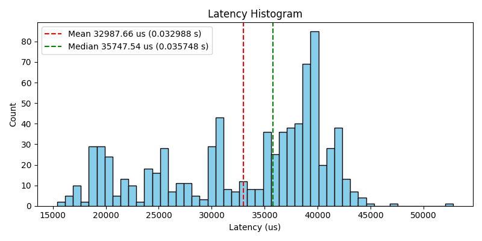
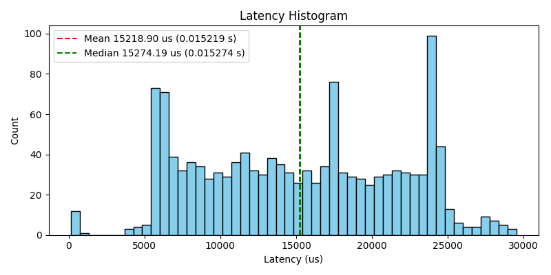
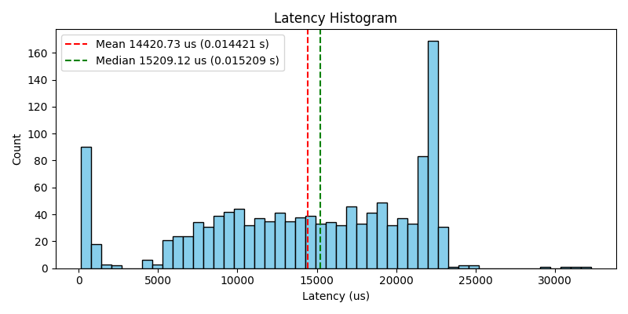
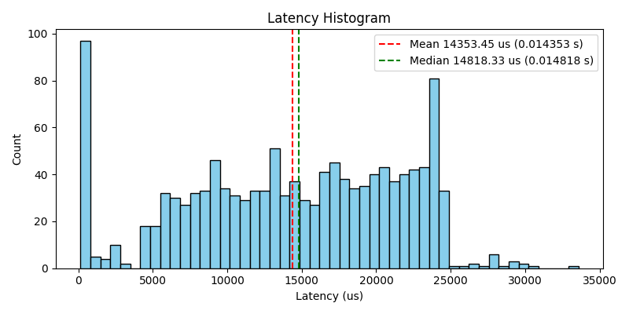
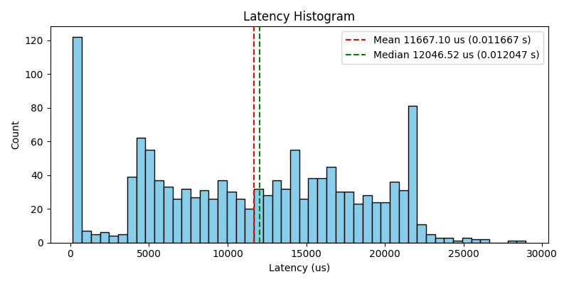
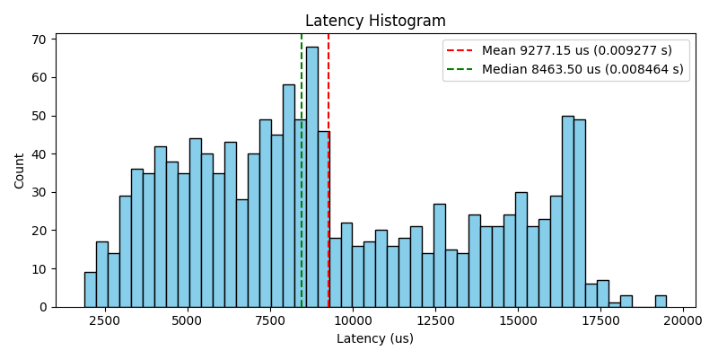

# Order Matching Engine 


## Overview

This project explores a low-latency order matching engine where packets are sent over UDP and ingested directly from the network card via `AF_XDP`. This project also focuses on profiling-driven optimization using `perf` and timers. The goal was to learn how to build an `AF_XDP` ingest path, quantify bottlenecks, and iteratively improve throughput and latency.

## System Design

We are sending packets (orders) from a server to the order matching servers via UDP. The structure of a packet follows below.

```
struct Packet {
  uint32_t seq_num;     // for dupes
  uint32_t order_id;    // unique id 
  uint32_t price_tick;  // 1 => $0.01 so 10123 = $101.23
  uint32_t qty;         // qty
  MsgType msg_type;     // New limit, cancel or modify
  Order_Type side;      // Sell, Buy
};
```

We are assuming the same ticker for this engine as it makes testing and profiling much easier to improve upon. To add more tickers all we need is a few hash maps and some extra logic and seeing that this project was mainly about improving networking, profiling, and modern C++ skills I didn't feel the need to include it. 

The sending server has two threads, one sending out orders with somewhat random quantities and price ticks. The other thread receives packets and logs the latencies based on the receiving time and the last order sent. 

We have two types of order matching servers. One is a basic engine that is single threaded and uses UDP sockets. The other uses `AF_XDP` along with three different threads and two different `SPSC` (single-producer single-consumer) queues. I tested out two different data structures for efficient matching and tried a few more optimizations like CPU pinning.


### Note:

This project was inspired by Carl Cook and David Gross. Both gave talks on fast trading systems in C++ at CppCon 2017 and 2024 respectively and I did take some ideas from them. 

## File Structure

```
/order_matcher
│── Makefile
│── README.md
│── /data                       # Holds stats and latencies (temporarily)
│── /plots                      # Plots of latency distributions
│── /src
│   ├── /basic_cpp              # Basic Single Threaded Engine with UDP
│   │   └── basic_engine.cpp    
│   ├── /cpp                    # Advanced Engine
│   │   ├── book_types.h
│   │   ├── match.cpp
│   │   ├── match.h
│   │   ├── order_book.h
│   │   ├── recv_helper.h
│   │   ├── send_from_engine.h
│   │   ├── send_to_engine.cpp
│   │   ├── spsc_ring.h
│   │   ├── xdp_kernal.c
│   │   └── xdp_recv.cpp
│   └── /cpp_helpers            # Holds Packet Struct
│       └── protocols.hpp      
│── /utils                      # Scripts to run
│   ├── plot.py
│   ├── run_basic_engine.sh
│   ├── run_engine.sh
│   └── run_server.sh
```


## Architecture
- UDP sender -> `AF_XDP` socket -> `SPSC` ring -> match loop -> `SPSC` ring -> trade sender.
- Matching engine: price levels stored in vectors with a bitmap to jump to best price in constant time (cheaper than `std::hash`).
- Lock-free: this project is lock-free so threads only have to wait for the rings to start filling, each thread reads from a ring and performs its operations independently of anything else.
- The rings are also aligned on the cache line size (64 bytes)


## Notes on `XDP` Mode and the latencies

This runs in `XDP` copy (`SKB`) mode on the VM because the virtual NIC does not support native/zero-copy `XDP`. The code still uses `AF_XDP` and the same control flow, but packets are copied by the kernel in this environment (sadly).

Also because this is running on a VM on a Mac the latencies are much higher than FPGA Linux box systems so don't pay too much attention to the microsecond counts as the % change of speedup is really what's important here.

## How to Run (VM)
From repo root:
```
./utils/run_engine.sh
```
In another terminal (sender):
```
./utils/run_server.sh
```
Plot latencies:
```
./utils/plot.py
```

### Note:

I hardcoded the IPs and Iface so you probably need to change this stuff around on your machine.

## How I went about profiling:

Initially I went into this project assuming I could use `perf` for everything and all would be well but I was very much wrong. `perf stat` doesn't work on the VM so I couldn't find any info on how I was performing on branches or the cache. `perf record` was also pretty useless because the vast majority of the time my program was spending in the queues waiting for data so I wasn't even able to figure out which functions were slow. If I had two Linux machines then these would have been pretty easy to use but I have to play with the cards I'm dealt so I decided to keep track of throughput statistics and latency (trade executed time - last order sent in the trade) and improve from there. 

## Results (Throughput Statistics):

### V1 stats:

This was my inital engine which was already kinda pretty optimized as I had watched a few videos on this and didn't do that bad of a job.


| sec  | orders_per_sec | trades_per_sec | total_orders | total_trades |
|-----:|---------------:|---------------:|------------:|-------------:|
| 0.003 | 41600.000 | 30400.000 | 126 | 86 |
| 0.005 | 28400.000 | 24400.000 | 197 | 147 |
| 0.007 | 0.000 | 0.000 | 197 | 147 |
| 0.010 | 0.000 | 0.000 | 197 | 147 |
| 0.013 | 0.000 | 0.000 | 197 | 147 |
| 0.015 | 0.000 | 0.000 | 197 | 147 |
| 0.018 | 57200.000 | 45200.000 | 340 | 260 |
| 0.020 | 93200.000 | 70400.000 | 573 | 436 |
| 0.022 | 0.000 | 0.000 | 573 | 436 |
| 0.025 | 190000.000 | 136000.000 | 1048 | 776 |
| 0.028 | 380800.000 | 304400.000 | 2000 | 1537 |
| 0.030 | 0.000 | 0.000 | 2000 | 1537 |
| 0.033 | 0.000 | 0.000 | 2000 | 1537 |
| 0.035 | 0.000 | 0.000 | 2000 | 1537 |
| 0.037 | 0.000 | 0.000 | 2000 | 1537 |
| 0.040 | 0.000 | 0.000 | 2000 | 1537 |


### V2 stats:

The zeros above in between massive trades/sec tell us this engine isn't dealing with compute-bound slowdowns i.e. our matching logic is pretty solid. So to improve upon V1 we will try and smooth out the input to reduce idle gaps. We will make our rings/buffers bigger to absorb bursts of orders and will use a hybrid backoff so that idle spin is reduced. 


| sec  | orders_per_sec | trades_per_sec | total_orders | total_trades |
|-----:|---------------:|---------------:|------------:|-------------:|
| 0.003 | 14400.000 | 8400.000 | 120 | 77 |
| 0.005 | 11600.000 | 8400.000 | 149 | 98 |
| 0.007 | 26000.000 | 19200.000 | 214 | 146 |
| 0.010 | 99200.000 | 78800.000 | 462 | 343 |
| 0.013 | 98000.000 | 80000.000 | 707 | 543 |
| 0.015 | 68800.000 | 52800.000 | 879 | 675 |
| 0.018 | 110800.000 | 87600.000 | 1156 | 894 |
| 0.020 | 59600.000 | 46800.000 | 1305 | 1011 |
| 0.022 | 68800.000 | 50800.000 | 1477 | 1138 |
| 0.025 | 62000.000 | 47600.000 | 1632 | 1257 |
| 0.028 | 60400.000 | 49600.000 | 1783 | 1381 |
| 0.030 | 70000.000 | 51200.000 | 1958 | 1509 |
| 0.033 | 16800.000 | 12000.000 | 2000 | 1539 |
| 0.035 | 0.000 | 0.000 | 2000 | 1539 |
| 0.037 | 0.000 | 0.000 | 2000 | 1539 |
| 0.040 | 0.000 | 0.000 | 2000 | 1539 |


### V3 stats:

Now that we aren't dealing with the 0s let's try and increase throughput and decrease latency by using another data structure than the pointer based `std::map`. I chose `std::vector` here as it has great cache locality and is dynamic so we can grow it as needed. (I did try to reserve a size but experienced a slowdown due to reserving too big of a size, so in the future I may try to find a better resizing method).


| sec  | orders_per_sec | trades_per_sec | total_orders | total_trades |
|-----:|---------------:|---------------:|------------:|-------------:|
| 0.003 | 0.000 | 0.000 | 346 | 229 |
| 0.005 | 6400.000 | 6000.000 | 362 | 244 |
| 0.007 | 0.000 | 0.000 | 362 | 244 |
| 0.010 | 19200.000 | 15600.000 | 410 | 283 |
| 0.013 | 70800.000 | 59200.000 | 587 | 431 |
| 0.015 | 114800.000 | 96400.000 | 874 | 672 |
| 0.018 | 93200.000 | 74800.000 | 1107 | 859 |
| 0.020 | 62400.000 | 51200.000 | 1263 | 987 |
| 0.022 | 70800.000 | 42400.000 | 1440 | 1093 |
| 0.025 | 65200.000 | 55600.000 | 1603 | 1232 |
| 0.028 | 73600.000 | 50800.000 | 1787 | 1359 |
| 0.030 | 50800.000 | 50000.000 | 1914 | 1484 |
| 0.033 | 34400.000 | 21200.000 | 2000 | 1537 |
| 0.035 | 0.000 | 0.000 | 2000 | 1537 |
| 0.037 | 0.000 | 0.000 | 2000 | 1537 |
| 0.040 | 0.000 | 0.000 | 2000 | 1537 |


### V4 stats:

Here I used a bitset to track which price levels are non-empty and jump to the next best level with bit-scan ops rather than full on scans.

- `ctz` (count trailing zeros): finds the index of the lowest set bit.
- `bsr` (bit scan reverse): finds the index of the highest set bit.

Also replaced the order_id -> info lookup from `unordered_map` to a flat array for faster, cache-friendly access without the `std::hash` overhead.


| sec  | orders_per_sec | trades_per_sec | total_orders | total_trades |
|-----:|---------------:|---------------:|------------:|-------------:|
| 0.003 | 0.000 | 0.000 | 319 | 250 |
| 0.005 | 0.000 | 0.000 | 319 | 250 |
| 0.007 | 1600.000 | 1600.000 | 323 | 254 |
| 0.010 | 81600.000 | 59600.000 | 527 | 403 |
| 0.013 | 59600.000 | 47600.000 | 676 | 522 |
| 0.015 | 64800.000 | 50000.000 | 838 | 647 |
| 0.018 | 54000.000 | 47200.000 | 973 | 765 |
| 0.020 | 64800.000 | 43600.000 | 1135 | 874 |
| 0.022 | 62400.000 | 52400.000 | 1291 | 1005 |
| 0.025 | 56800.000 | 47600.000 | 1433 | 1124 |
| 0.028 | 60000.000 | 49200.000 | 1583 | 1247 |
| 0.030 | 62000.000 | 46400.000 | 1738 | 1363 |
| 0.033 | 28800.000 | 27200.000 | 1810 | 1431 |
| 0.035 | 76000.000 | 64000.000 | 2000 | 1591 |
| 0.037 | 0.000 | 0.000 | 2000 | 1591 |
| 0.040 | 0.000 | 0.000 | 2000 | 1591 |


### V5 stats:

I used thread pinning here. My VM is allocated 5 cores and so I pinned 1-3 on the `XDP`, Matcher, and Output respectively and left core 0 for OS activities and core 4 for the stats I was doing. Note that because I am on a VM this isn't hard pinning like on the physical CPU but it still should help and ended up helping


| sec  | orders_per_sec | trades_per_sec | total_orders | total_trades |
|-----:|---------------:|---------------:|------------:|-------------:|
| 0.003 | 0.000 | 0.000 | 149 | 113 |
| 0.005 | 0.000 | 0.000 | 149 | 113 |
| 0.007 | 105600.000 | 82400.000 | 413 | 319 |
| 0.010 | 134400.000 | 112800.000 | 749 | 601 |
| 0.013 | 62800.000 | 47600.000 | 906 | 720 |
| 0.015 | 46800.000 | 34400.000 | 1023 | 806 |
| 0.018 | 55200.000 | 45200.000 | 1161 | 919 |
| 0.020 | 37600.000 | 34800.000 | 1255 | 1006 |
| 0.022 | 8400.000 | 5200.000 | 1276 | 1019 |
| 0.025 | 172800.000 | 140400.000 | 1708 | 1370 |
| 0.028 | 76400.000 | 58400.000 | 1898 | 1516 |
| 0.030 | 40800.000 | 39600.000 | 2000 | 1615 |
| 0.033 | 0.000 | 0.000 | 2000 | 1615 |
| 0.035 | 0.000 | 0.000 | 2000 | 1615 |
| 0.037 | 0.000 | 0.000 | 2000 | 1615 |
| 0.040 | 0.000 | 0.000 | 2000 | 1615 |

## Results (Latency Histograms)

Below are histograms for the respective versions showing the latency distributions. 

Baseline (basic engine):


### Engine V1:



### Engine V2:



### Engine V3:



### Engine V4:



### Engine V5:




## Optimization Summary and Speedup Table

- V1: baseline `AF_XDP` path with ring buffers and match loop.
- V2: larger rings plus hybrid spin/backoff to reduce idle overhead.
- V3: vector-based price levels to reduce pointer chasing.
- V4: bitmap + bit-scan to jump to best price and flat array for order_id lookup.
- V5: thread pinning to reduce cross-core contention.


| Version | Mean (us) | Median (us) | Mean speedup vs Basic | Median speedup vs Basic | Mean speedup vs Prev | Median speedup vs Prev |
|:--|--:|--:|--:|--:|--:|--:|
| Basic | 32987.66 | 35747.54 | 1.000x | 1.000x | - | - |
| V1 | 15218.90 | 15274.19 | 2.168x | 2.340x | 2.168x | 2.340x |
| V2 | 14420.73 | 15209.12 | 2.288x | 2.350x | 1.055x | 1.004x |
| V3 | 14353.45 | 14818.33 | 2.298x | 2.412x | 1.005x | 1.026x |
| V4 | 11667.10 | 12046.52 | 2.827x | 2.967x | 1.230x | 1.230x |
| V5 | 9277.15 | 8463.50 | 3.556x | 4.224x | 1.258x | 1.423x |


## Comprehensive File Overview
- `Makefile`: build targets for engine and tools.
- `src/cpp/xdp_kernal.c`: `XDP` program (redirect to `AF_XDP` socket).
- `src/cpp/xdp_recv.cpp`: engine entrypoint, `AF_XDP` setup, stats, thread pinning.
- `src/cpp/match.cpp`: matching logic.
- `src/cpp/order_book.h`: order book data structures and best‑price logic.
- `src/cpp/book_types.h`: price range and book type aliases.
- `src/cpp/send_to_engine.cpp`: UDP order generator + latency capture.
- `src/cpp/send_from_engine.h`: trade sender thread.
- `src/cpp/spsc_ring.h`: single‑producer/single‑consumer ring.
- `src/cpp_helpers/protocols.hpp`: shared wire structs and enums.
- `utils/run_engine.sh`: build and run engine.
- `utils/run_server.sh`: build and run sender.
- `utils/run_basic_engine.sh`: build and run basic engine.
- `utils/plot.py`: plots `data/latencies.csv` into `plots/`.
- `data/latencies.csv`: latency samples (ns).
- `data/stats.csv`: orders/sec and trades/sec samples.
- `plots/*.png`: saved graphs and histograms.


## Final Thoughts:

This was a fun project and I learned a lot. I definitely want to get better at Linux programming and `perf` but I think this was a great start.

Author: Jason Majoros
